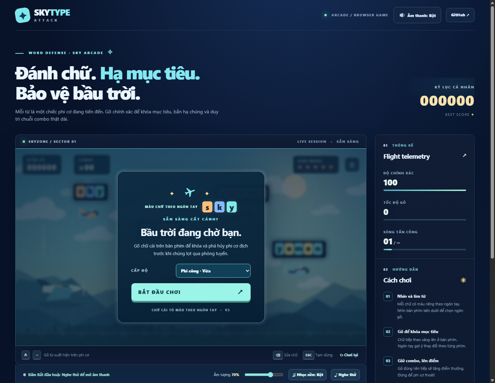

# SkyType Attack ✦

A lightweight, responsive browser typing-defense game inspired by retro sky arcade games.

**[Play on GitHub Pages](https://trinhtanphat.github.io/sky-typing-attack/)**



## Version 1.2.1 — high-contrast finger letters

Every aircraft word uses **solid, brightly colored keycap tiles** (not barely tinted text). The main menu previews `s k y` in three finger colors so you can confirm the new version immediately. Letter colors match the QWERTY guide.

If a previously installed offline version is still showing pale labels, open the cache-busting URL: **[Open color edition V3](https://trinhtanphat.github.io/sky-typing-attack/?v=3)**. The refreshed service worker uses network-first caching.

## Gameplay
- English words float above incoming aircraft.
- Type a word to lock on, keep typing to shoot it down.
- If multiple words begin with the same letter, the aircraft nearest the left defense line is targeted first.
- Every enemy that crosses the line costs a life.
- Keep your combo for extra points, survive increasingly fast waves.
- Three difficulty settings: Recruit, Pilot, Ace.
- Score, accuracy, words per minute, and local high score.
- Pause with **Esc**, delete a character with **Backspace**, replay anytime.
- Includes a mobile input field for touch keyboards.
- Self-contained vector art, background parallax, **Web Audio synthesizer** (audible shots/hits/combos/danger sounds and melodic BGM), adjustable volume, separate BGM toggle, and a sound-check button. Audio begins only after a real user gesture, as required by browsers.
- **Finger-color training mode:** color-coded individual letters on enemy labels and word progress; 26-key on-screen QWERTY visualization, eight finger color categories and live next-key highlighting; standard touch-typing zones.
- Zero trackers and no external image, font or audio dependencies.
- Progressive Web App cache after first online visit.

## Run locally
Use an HTTP server (ES modules cannot reliably be loaded with a `file://` URL):

```bash
python -m http.server 8080
# open http://localhost:8080
```

Or `npx serve .`. No build step, Node dependencies, runtime API, or server database are required.

## Test
```bash
node --test tests/*.test.mjs
```

The tests use Node built-in test runner and test pure scoring, word targeting, validation and pacing logic.

Optional browser QA: serve the game on port 8763, start Chrome with a DevTools remote debugging port 9351 (or set `CDP_PORT`) and run `node scripts/smoke-cdp.mjs`. This also captures `preview.png` and tests keyboard play, pause/resume, mobile viewport and uncaught exceptions. Then run `node scripts/verify-color-sound-cdp.mjs` to exercise real pointer-triggered AudioContext activation, live color highlights, volume and BGM controls.

## Host on GitHub Pages
Repository Settings → Pages → **Deploy from a branch** → `main` → `/(root)`. The deployment is static and also works with the repository subpath. This repository has no GitHub Actions workflow.

## Project map
- `index.html` — semantic and responsive layout
- `styles.css` — interface styling
- `src/game.js` — canvas rendering, input handling, game loop, audio and persistence
- `src/engine.js` — pure rules and vocabulary
- `src/fingers.js` — QWERTY finger layout and color mapping
- `src/audio.js` — browser-unlocked Web Audio mixer and synthesized music/SFX
- `tests/` — deterministic unit tests
- `sw.js` and `manifest.webmanifest` — offline app caching

## Accessibility and privacy
Keyboard-first game, text labels, native buttons and input, high contrast HUD, reduced-motion transitions, local-only high score. All score data stays in this browser's localStorage.

## License
MIT — original implementation. No copyrighted art or code from the reference game is included.
